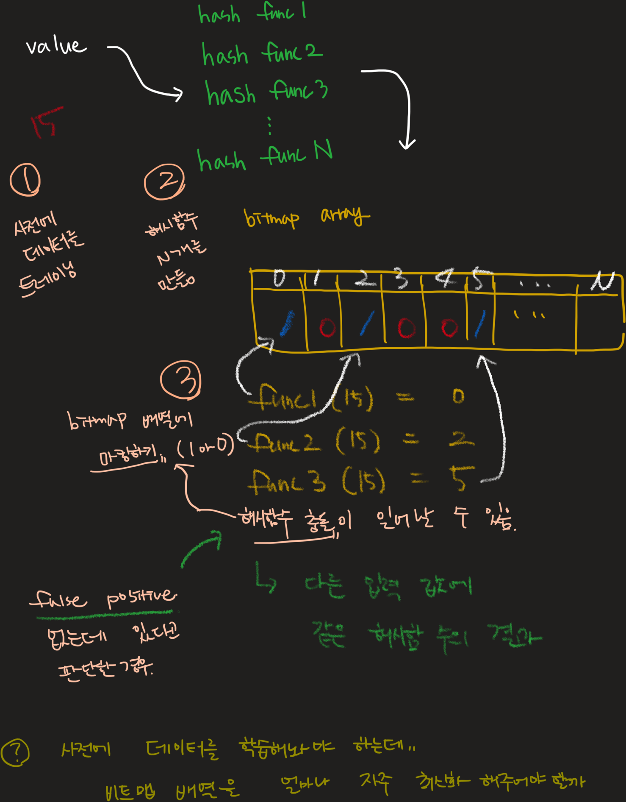

# Bloom Filter

<mark style="color:orange;">알아두면 쓸데있는 자료구조 시리즈 (1)</mark>

&#x20;

**너는 누구냐\~**

* 중복 검사 하는 필터라고 생각하면 됨.
* 1970년 Burton Howard Bloom 이라는 아조씨가 고안함
  * 아마 이때 당시 컴퓨터는 저장 장치의 크기가 작다 보니.
  * 공간 효율성을 최대로 가져가는 어떤 중복 검사에 대한 요구가 있었던 것으로 추정함
* 사전적인 의미로는 어떤 대상이 해당 집합에 속해있는지 검사하는 확률형 자료구조

**언제 쓰나요?**

* 거짓 긍정(False Positive)을 해도 크게 문제가 없는 중복 검사 기능을 구현할 때 사용
* 예를 들어, 어떤 값이 해당 집합에 포함되어 있지 않은데(거짓) 포함되어 있다고 (긍정) 판별 할 때 이 경우가 문제 되지 않는다면 사용

**왜 쓰나요?**

* 빠르니깐 쓴다! (공간 효율성이 좋기 때문)
  * 비트맵 배열의 공간 효율성을 확인해보자 1MB = 8,000,000bit
  * 해시 충돌에 의한 거짓 긍정이 일어나지 않는다고 가정하고 (그럴일은 없겠지만 1)
  * 1개의 해시 함수를 사용한다고 했을 때 (그럴일은 없겠지만 2)
  * 1MB 의 공간 효율로 최대 8백만개의 중복 검사를 수행할 수 있음
* 어떤 데이터를 찾는데 드는 시간이 일반적인 중복 검사를 하는 것에 비해 매우 빠름

&#x20;**어디에서 사용 중인가요?**

* Key-Value 저장소 (레디스) 와 같이 Key 값을 검색할 때 사용
* 의심스러운 URL 검사 (블랙리스트)

**실제 적용해본다면?**

* 사용자를 생성할 때 이메일 중복 체크

아래 그림을 통해 알아보자 🔭

<figure><figcaption></figcaption></figure>

